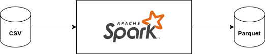
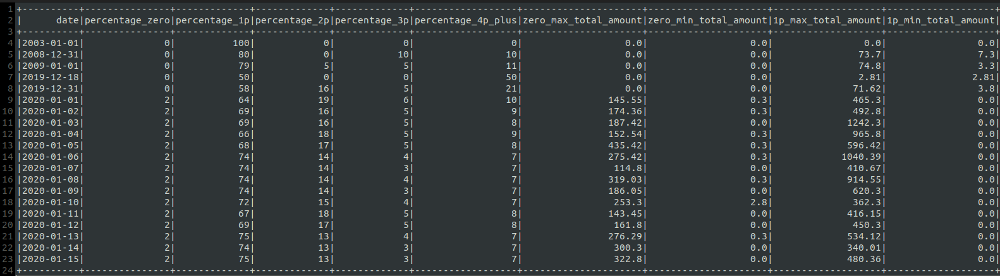
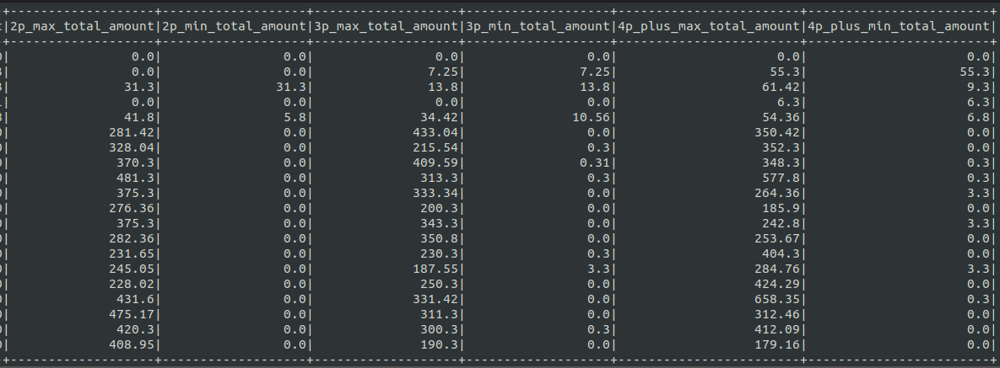
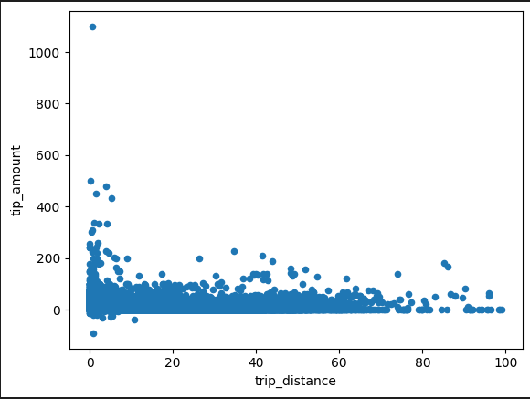
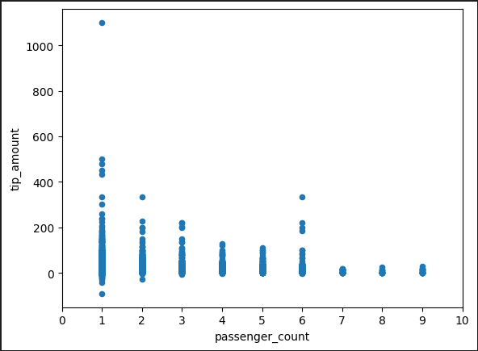

# Проект №5. Служба такси.

## Постановка задачи:
Есть таблица, состоящая из поездок такси в Нью-Йорке.

Необходимо, используя таблицу поездок для каждого дня рассчитать процент поездок по количеству человек в машине (без пассажиров, 1, 2, 3, 4 и более пассажиров). Также добавить столбцы к предыдущим результатам с самой дорогой и самой дешевой поездкой для каждой группы.

По итогу должна получиться таблица (parquet) с колонками date, percentage_zero, percentage_1p, percentage_2p, percentage_3p, percentage_4p_plus. Технологический стек – sql, scala (что-то одно).

**Дополнительно**: также провести аналитику и построить график на тему “как пройденное расстояние и количество пассажиров влияет на чаевые” в любом удобном инструменте.


## Ход работы и его этапы:
1. Загрузить данные из .csv файла в Spark. 
2. Выполнить трансформацию и вычисления. 
3. Сохранить результат в файлы .parquet
4. Выполнить доп. анализ и построить график в PySpark.


## Структура проекта:
Проект имеет следующую структуру:
```bash
.
├── code                   			# Файлы с кодом
├── images                      	# Рисунки для Github и доп. материалы
├── inputData                       # Входные данные
├── outputData                      # Выходные данные
├── .gitignore                      # Файл для Git
└── README.md						# Файл с описанием проекта
```

В папке inputData находятся входные данные из файла .csv [yellow_tripdata_2020-01.csv](https://disk.yandex.ru/d/DKeoopbGH1Ttuw)
В этой же папке находится файл analysis.ipynb с результатми доп. аналитики и графиками..

В папке outputData находятся выходные данные в формате .parquet

<details>
  <summary>Пример запуска приложения:</summary>
```
spark-submit 
    --class org.example.App 
    ./finalp.jar /home/user/finalp/inputData/yellow_tripdata_2020-01.csv /home/user/finalp/outputData/
```
</details>

<details>
  <summary>Схема работы приложения:</summary>

</details>

## Результаты и выводы:

<details>
  <summary>Пример результата обработки</summary>



</details>


На основании графиков из фала inputData/analysis.ipynb можно сделать выводы, что:

1. Чем больше дистанция поездки, тем меньше чаевых.

    

2. Больше всего чаевых оставляет один человек. Чем больше пассажиров, тем меньше чаевых они оставляют. 

    


