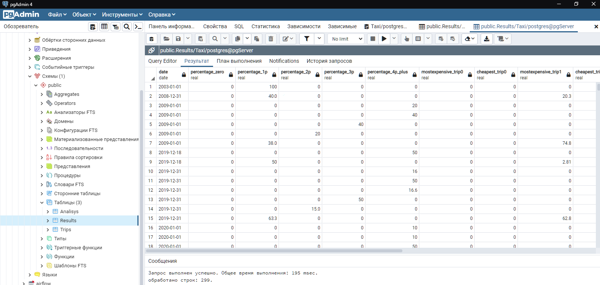
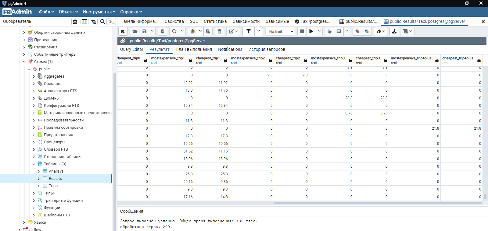
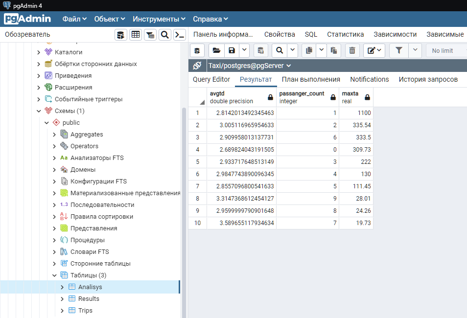
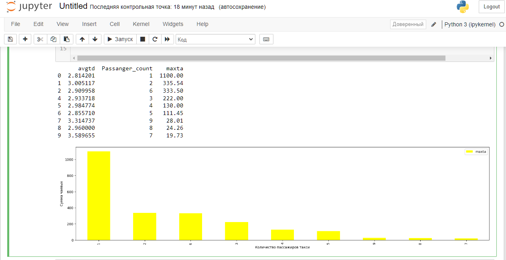

# Проект №5. Служба такси.

## Постановка задачи:
Есть таблица, состоящая из поездок такси в Нью-Йорке.

Необходимо, используя таблицу поездок для каждого дня рассчитать процент поездок по количеству человек в машине (без пассажиров, 1, 2, 3, 4 и более пассажиров). Также добавить столбцы к предыдущим результатам с самой дорогой и самой дешевой поездкой для каждой группы.

По итогу должна получиться таблица (parquet) с колонками date, percentage_zero, percentage_1p, percentage_2p, percentage_3p, percentage_4p_plus. Технологический стек – sql, scala, python (что-то одно).

**Дополнительно**: Провести аналитику и построить график на тему “как пройденное расстояние и количество пассажиров влияет на чаевые” в любом удобном инструменте.


## Ход работы и его этапы:
1. Импортировать данные из .csv файла в PostgreSQL
2. Выполнить обработку и вычисления. 
3. Экспортировать результаты в файлы .csv и .parquet
4. Выполнить доп. анализ и построить график в Python


## Структура проекта:
Проект имеет следующую структуру:
```bash
.
├── code				# Файлы с кодом
├── images				# Рисунки и доп. материалы
├── inputData				# Входные данные
├── outputData				# Выходные данные
├── .gitignore				# Файл для Git
└── README.md				# Файл с описанием проекта
```

В папке inputData находятся входные данные из файла .csv [yellow_tripdata_2020-01.csv](https://disk.yandex.ru/d/DKeoopbGH1Ttuw)

В папке code находятся файлы с кодом для обработки данных и доп. аналитики..

В папке outputData находятся выходные данные в формате .csv и .parquet

<details>
  <summary>Технологический стек:</summary>
SQL (PostgreSQL, PgAdmin), Python (Pandas, mathplotlib)
</details>

<details>
  <summary>Схема взаимодействия приложений:</summary>
	.csv -> PostgreSQL -> SQL -> .csv -> Python -> .parquet
</details>

## Результаты и выводы:

<details>
  <summary>Пример результатов обработки:</summary>

	

</details>


Из результатов анализа можно сделать вывод о том, что чем большее количество пассажиров едет в такси, тем меньшее количество чаевых они оставляют. При этом, среднее пройденное расстояние поездки практически никак не влияет на размер чаевых.

	


